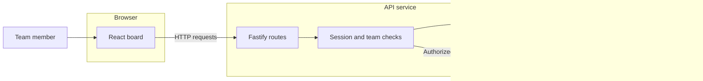
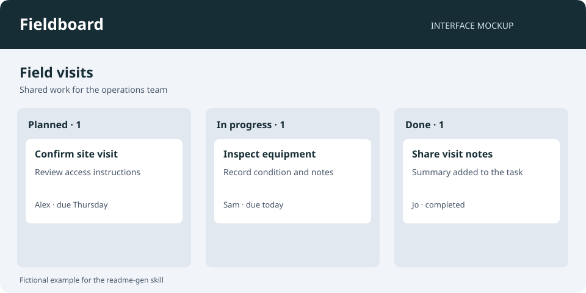

# Fieldboard

> A shared task board for small teams planning field visits.

> [!NOTE]
> This is a fictional README demonstrating `readme-gen` output. Its application, commands, source tree and MIT license are an illustrative project contract, not claims about this skill repository. The bundled image is a mockup. No application fixture, public deployment or registry package is provided.


## Tech Stack

| Area | Technology |
| --- | --- |
| Browser interface | React |
| Application language | TypeScript |
| HTTP API | Fastify |
| Persistence | PostgreSQL |
| Local services and deployment | Docker Compose |
| Unit and integration tests | Vitest |

## Overview

Fieldboard gives field coordinators and teammates one place to record visits, assign work and track completion. A board groups tasks into Planned, In progress and Done so the next action is visible without opening each task.

Teammates sign in, open a board and update the work assigned to them. Coordinators can create tasks and change assignments within their team.

## Features

- Team boards with planned, active and completed tasks.
- Task assignment, due dates and visit notes.
- Session-based access with team membership checked by the API.
- Filtering by assignee to review a teammate's current work.

## Architecture



The browser presents boards and sends task changes to the API. The API checks the session and team membership before reading or changing task data. PostgreSQL stores tasks, memberships and sessions; the browser does not connect to it directly.

## Screenshots



*Illustrative interface mockup included with this skill; not a captured or running application.*

## Getting Started

The commands in this section belong to the fictional project contract described above. They demonstrate the level of specificity a generated README should provide after inspecting a real repository.

### Prerequisites

- Node.js and pnpm at the versions declared by the fictional repository's runtime and package-manager configuration.
- Docker with Compose for the local PostgreSQL service.

### Installation and configuration

From the application repository root:

```bash
pnpm install
cp .env.example .env
```

Configure these names in `.env`; actual credential values are deliberately absent:

```env
DATABASE_URL=
SESSION_SECRET=
```

| Variable | Required | Scope | Purpose |
| --- | --- | --- | --- |
| `DATABASE_URL` | Yes | Server runtime secret | PostgreSQL connection string for the selected environment |
| `SESSION_SECRET` | Yes | Server runtime secret | Secret used by the session implementation |

Both variables stay on the server. The browser uses the API through its same-origin `/api` path.

### Run locally

```bash
docker compose up -d db
pnpm db:migrate
pnpm dev
```

The development command starts the browser application and API. Open the local address printed by the development server. The migration command changes the database selected by `DATABASE_URL`; use a local development database for this setup.

## Project Structure

The fictional source layout separates presentation from access checks and task operations:

```text
.
├── apps/
│   ├── web/                 # Board interface and browser interactions
│   └── api/                 # HTTP routes, sessions and team authorization
├── packages/
│   └── contracts/           # Request and response types shared by both apps
├── database/
│   └── migrations/          # Changes to persistent tables
├── tests/                   # Task and access-control integration cases
├── compose.yml              # Local PostgreSQL service
├── compose.production.yml   # Web, API and database deployment definition
├── .env.example             # Server configuration names
├── package.json             # Root development and validation commands
├── pnpm-lock.yaml           # Resolved workspace dependencies
└── pnpm-workspace.yaml      # Application and shared-package membership
```

## Usage

1. Sign in and open a board for your team.
2. Create a visit task with an assignee and due date.
3. Move the task to In progress when work begins.
4. Add visit notes, then mark it Done.

Use the assignee filter to focus the board on one teammate's work. Only members of the board's team can access its tasks.

## Testing

```bash
pnpm typecheck
pnpm lint
pnpm test
```

These contract-defined commands check types, lint the workspaces and run the test suites. Integration tests use a separate PostgreSQL test database. This example does not report test counts, passing runs or coverage because no application tests were executed.

## Deployment

The fictional production Compose definition contains separate web, API and PostgreSQL services. The web service serves the built interface and forwards `/api` requests to the API service. Only the API receives the database connection and session secret.

Build the application before deploying:

```bash
pnpm build
```

Deploying the Compose definition changes running services; the migration command changes the selected database. Configure the target environment and arrange a database backup before a production migration. No live deployment URL or automated release workflow is asserted by this example.

## Security

The API verifies sessions and team membership before allowing task access. Server credentials must not be included in browser configuration or committed environment files. These are specific controls in the fictional design, not a claim that the system has undergone a security audit.

## Documentation

- [Architecture](#architecture): component boundaries and request path.
- [Getting started](#getting-started): local services, configuration and startup.
- [Deployment](#deployment): separate production services and migration context.

The example uses section links because it does not bundle separate application documentation. A real generated README should link existing deeper documents where available.

## License

The fictional Fieldboard project is assumed to use the MIT License for illustration. No application license file is bundled, and this statement does not license the `readme-gen` skill itself. A real README must name and link the repository's verified license file.
