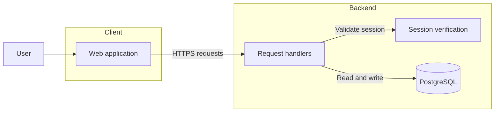
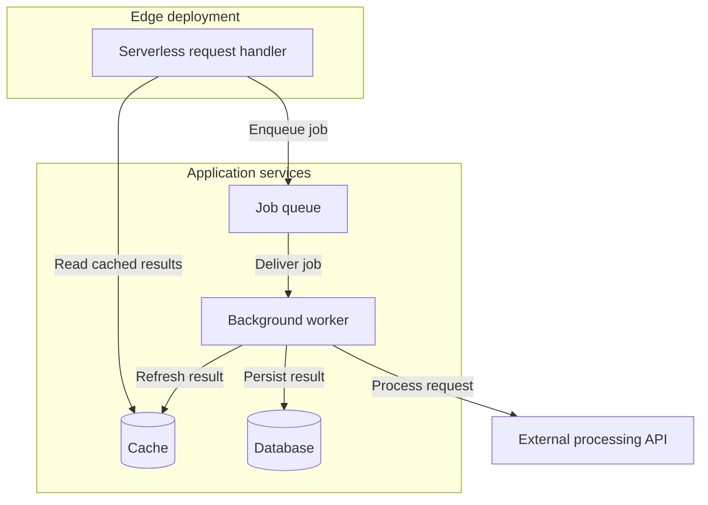
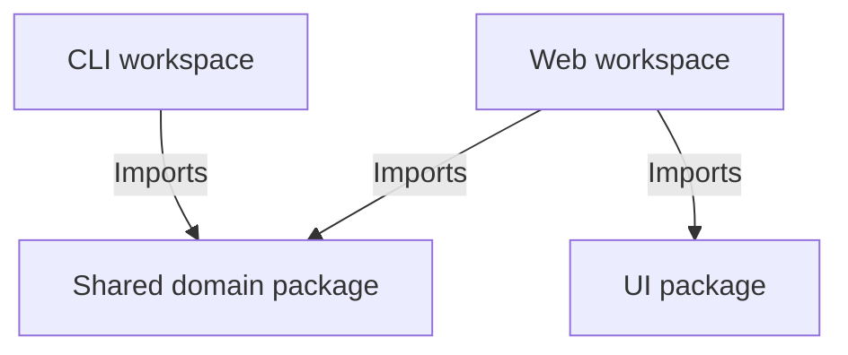
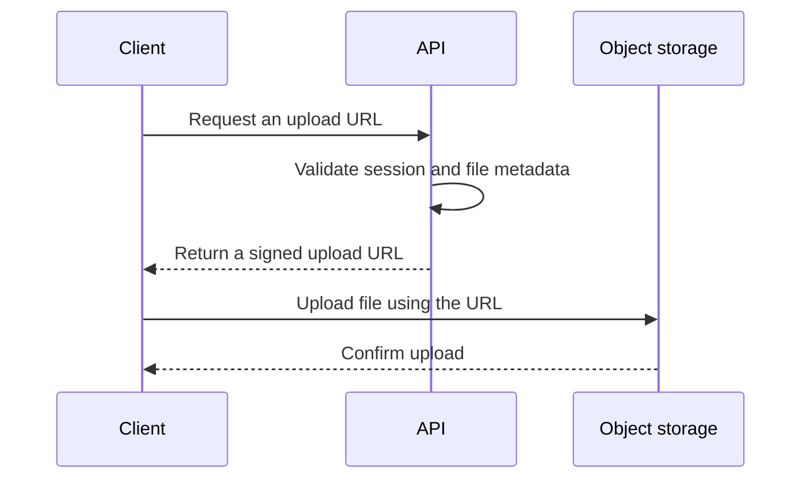

# Mermaid architecture

## Model the actual system

Trace entry points, callers, storage operations and integrations before drawing. Each node needs evidence of a material responsibility; each arrow needs evidence of a relationship. Keep runtime request flow, workspace dependencies and deployment topology distinct, or label the relationship types explicitly. A package dependency alone does not establish a running service.

Prefer roughly 5–15 major nodes for substantial systems, fewer for simple ones. Group related implementation details into responsibilities rather than listing components, hooks, routes, tables and helpers. Use subgraphs for client/backend, process or deployment boundaries. Explain the major responsibilities in a short paragraph after the diagram; link deeper architecture only when that file exists.

## GitHub syntax

Use a fenced block with the `mermaid` language. GitHub supports Mermaid rendering and provides a way to inspect its current renderer version; do not assume it matches a local installation. See [GitHub diagram documentation](https://docs.github.com/en/get-started/writing-on-github/working-with-advanced-formatting/creating-diagrams).

Prefer conservative flowcharts: `flowchart LR` for lateral request paths, `flowchart TD` for a hierarchy or vertical pipeline. Use stable ASCII IDs and human-readable quoted labels. Use `DB[("Database")]` for persistence. Avoid custom themes, initialization directives, HTML labels, scripts, click handlers and obscure/new syntax unless specifically justified and verified. Let the hosting renderer choose light/dark styling.

The following are fictional patterns. Replace their components and edges with evidence; do not copy them into a repository merely because they render.

## Client and backend request flow

Use this shape only if the backend verifies sessions. If authentication is delegated to an external identity provider, represent the actual delegation and caller; do not imply that the browser accesses server-only credentials or a private database.

## Jobs, external providers and deployment boundaries

Include cache only if lookup/update code exists; show a queue only when producer and consumer paths are established. A serverless boundary comes from execution/deployment config. Replace “External processing API” with the actual provider when verified. Do not infer security, durability or retry guarantees from this diagram.

## Workspace dependencies

Caption this as build/import dependencies. Shared packages are not necessarily separately deployed services. Use a separate runtime diagram only when readers need both perspectives.

## Sequence diagrams

Use for a non-obvious lifecycle such as authentication, upload, payment or AI retrieval when sequence matters. Derive participants, ordering and failure paths from actual handlers; avoid speculative “secure validation” steps.

This depicts one fictional direct-upload design, not a default for all storage SDKs. A README usually needs one architecture diagram; add a sequence only when it answers an additional important question.

## Validation and common failures

- Check all fences, brackets, quotes, arrows and matching `subgraph`/`end` pairs. Avoid `end` as a node ID and troublesome punctuation in unquoted labels; give the node a simple ID and a quoted label.
- Re-check arrow direction and type against source. A valid graph can still describe the wrong architecture.
- Avoid unsupported HTML/CSS, elaborate styling, theme overrides, and so many edges that labels collide.
- When an existing Mermaid parser/renderer is available, validate every diagram and inspect its rendered output when possible. Do not install tooling merely to inspect a repository without a justified need and appropriate scope.
- If tooling is unavailable, perform a conservative manual review and report “syntax reviewed; not rendered.” Do not call that parser validation or GitHub visual verification.
- Simplify until legible. Ensure the prose conveys the essential responsibilities even for readers who cannot view the diagram.
